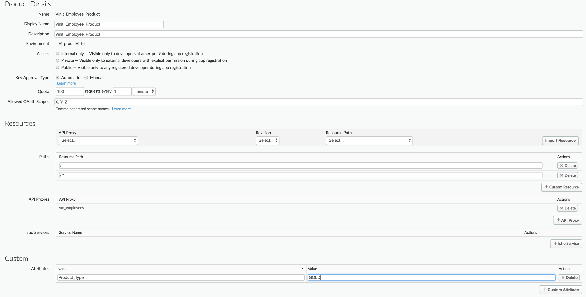
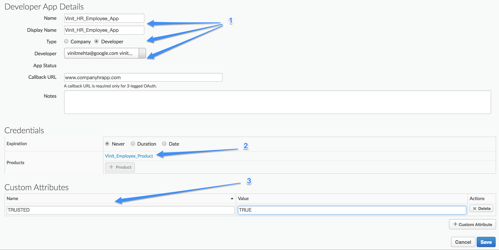
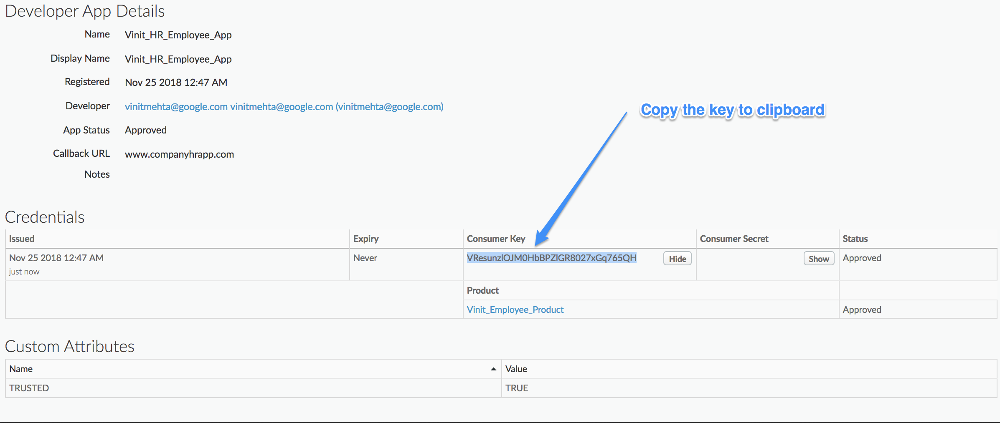
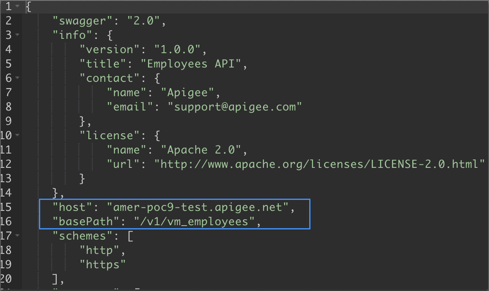

# Apigee API Jam Lab Guide

Welcome to Apigee API Jam workshop. This hands-on workshop takes into account the experience of hundreds of customers who have used Apigee Edge to implement a successful API program. By the end of this workshop, you will walk away with practical experience using the Apigee Edge platform, along with an understanding of its comprehensive capabilities.

## Pre-requisites

* **Apigee Account** - If you don’t have an account, sign-up for a trial account at [https://login.apigee.com/sign__up](https://login.apigee.com/sign__up).  We will notify you on the registered email, once the account is created. This could take a few minutes.

* **REST Client** - You'll need to be able to make API calls throughout the labs.  Although any client will work, we strongly recommend those without experience with a particular tool to use our hosted REST client, which can be found [here](https://apigee-rest-client.appspot.com/) ← (open in a new tab and open as many as you need)
    * If you are proficient using the Postman application, you'll find a collection [here](https://www.getpostman.com/collections/465b679a4c435317eebb).  Only do this if you understand Postman, importing collections and environments, and working with environment and global variables in Postman.
 

## Lab 1: Import a proxy

### Summary

In this lab, we will import a pre-built API proxy bundle into the Apigee Edge platform. 

### API Proxy Bundle
An API Proxy Bundle is a collection of API Proxy artifacts and policies that represent the configuration of such API Proxy. 

#### Instructions

1. Download the Proxy bundle from the [API Jam repository](https://github.com/kford/apijam/raw/master/Resources/payments-apiproxy-bundle.zip). Click **Download**.


2. Go to [https://apigee.com/edge](https://apigee.com/edge) and log in to your new Apigee trial organization. Under your username, select the Organization for which you are an "Organization Administrator"


3. Navigate the **Develop → API Proxies** on the left side menu, click **+Proxy** in the top right corner to invoke the Create Proxy Wizard. Then select **Proxy Bundle**, and click next. 


4. You will need to click on the **Choose File** button next to the **ZIP Bundle** option and select the **payments_apiproxy_bundle.zip** from the Github repository you downloaded above. Enter the following details in the proxy wizard and click **Next**, then **Build.**

    * Proxy Name : **&lt;&lt;YOUR-INITIALS&gt;&gt;_payments**
    * Click on the link to view your API proxy in Proxy Editor.

5. Your API Proxy's base paths must be unique within an organization.  You can see the current base paths in the "Overview" tab of the API Proxy.  Your "default" proxy endpoint's base path should be set to "/v1/payments" and your "loadgenerator" proxy endpoint's base path should be set to "/v1/loadgenerator".  To avoid conflicting with others, change both of the base paths to include your initials.


    * Click on the "Develop" Tab
    * Click the "default" Proxy Endpoint
    * Edit the BasePath element to include your initials as shown below
    * Save the API Proxy

5. Do the same as above for the "loadgenerator" proxy endpoint.

5. Click the **Deployment** dropdown, select the **test** environment, then **Deploy** from the **Overview** tab.


6. Once your API is deployed successfully, if you're not already in the **Develop** section, select **Develop** in the right side tab bar menu and the API Proxy configuration view is displayed.  You can browse the interface and see how the Proxy is configured.  Observe that the Proxy supports several operations with different HTTP methods (GET, POST).  It also defines error handling for all other routes.

 ### Call loadGenerator API 
Now we are going to call load-generator API to populate some data for Analytics. We will explore more on Analytics in Lab-6. 

NOTE - When you invoke this API, you will only see a `HTTP 200 OK` response.

* **{FQDN}** (Fully Qualified Domain Name) refers to the URL at which Apigee is
  hosting your API Proxy.  This can be found on the overview page of your API
  proxy, and will look something like: https://amer-demo1-test.apigee.net
* The loadgenerator endpoint needs a header called "basepath" which should be set to the basepath that you changed to include your initials.  Because you deployed the loadgenerator from a previously created proxy bundle, passing in the basepath via header allows it to generate load on the custom proxy endpoint (with initials) that you just deployed.  This is because loadgenerator proxy is part of the downloaded Zip file but you've changed your basepath to include your initals.  Using the Apigee REST client, enter the URL like below, substituting your FQDN and basepath, as below
    * If you are using the **Apigee REST client**
        * enter URL: https://{FQDN}/v1/{YOUR_INITIALS}_loadgenerator   (where {FQDN} is replaced with the URL in your API Overview Tab)
    * If you are using **cURL**, then an example is below
        * ```curl -v -H 'basepath: /v1/{YOUR_INITIALS}_payments' https://{FQDN}/v1/{YOUR_INITIALS}_loadgenerator```
    * If you are using **Postman**, then call the loadgenerator API from your collection, including the basepath as above


## Lab 2: Explore policies

### Summary

In this lab, we will explore the various API proxy policies that can be configured in Apigee. 

### Spike Arrest Policy

The Spike Arrest policy protects against traffic spikes. It throttles the number of requests processed by an API proxy and sent to a backend, protecting against performance lags and downtime.

**Instructions:**

1. Navigate to the **Target Endpoints** default **Preflow** and highlight the **Spike Arrest** policy. The default **Spike Arrest** rate in the API Proxy is 10pm.


2. Select **Overview** in the right side tab bar menu and copy the **Payments Deployments URL** for the **test** environment. 

3. Select **Trace** in the right side tab bar menu and the API Proxy configuration view will be displayed. Paste the Payments Proxy URL into the **Send Request URL** section.  Select **Start Trace Session**, then click the **Send** button a few times rapidly to trigger the **Spike Arrest** policy. Click on the **Spike Arrest** policy icon in the **Transaction Map** to view the flow details in the **Phase Details** section below. 


* As an alternative to sending requests from the trace view, you can invoke the API proxy via **cURL** or the **Apigee REST Client**
        curl https://{FQDN}/v1/<<YOUR_INITIALS>>_payments

### Verify API Key Policy
The Verify API Key policy lets you enforce verification of API keys at runtime, letting only apps with approved API keys access your APIs. This policy ensures that API keys are valid, have not been revoked, and are approved to consume the specific resources associated with your API products. 

**Instructions:**

1. Select **Develop** in the right side tab bar menu. Navigate to the **Proxy Endpoints** default **Preflow** and highlight the **Verify API Key** policy. Change the ‘enabled=**false’** to ‘enabled=**true’**, then click the blue **Save** button.


2. Select **Trace** in the right side tab bar menu and the API Proxy configuration view is displayed and select **Start Trace Session**. Click the **Send** button in the **Send Request URL** section to trigger the **Verify API Key** policy. You should receive a HTTP 401 error.
    * *note: verify that the URL in the trace tool is your payments proxy endpoint, not the loadgenerator proxy endpoint*

    Alternatively...
        curl -v https://{FQDN}/v1/<<YOUR_INITIALS>>_payments

In a later lab, we will see how to acquire an API key which you can use to make successful (HTTP 200) calls, now that your API Proxy is secured

## Lab 3: Management APIs

### Summary

In this lab, we will see how to use the Apigee management APIs to automate the promotion of API from a lower environment (test) to a higher environment (prod). Copy the following command into an editor and replace {Your-org-Name}, {Your-proxy-name} and {Your-Apigee-Email-Address} before executing. 

```
curl -X POST -H "Content-type:application/x-www-form-urlencoded" https://api.enterprise.apigee.com/v1/o/{Your-org-Name}/e/prod/apis/{Your-proxy-name}/revisions/1/deployments -u {Your-Apigee-Email-Address}
```
NOTE - Don't include `{` or `}` in your command. Here is a sample : 
```
curl -X POST -H "Content-type:application/x-www-form-urlencoded" https://api.enterprise.apigee.com/v1/o/myorg/e/prod/apis/kf_payments/revisions/1/deployments -u myname@gmail.com
```

When prompted, enter your Apigee Password.

You should see a success response which looks like this: 
```
{
  "aPIProxy" : "Payments",
  "configuration" : {
    "basePath" : "/",
    "steps" : [ ]
  },
  "environment" : "prod",
  "name" : "1",
  "organization" : "{your_organization}",
  "revision" : "1",
  "server" : [ {
    "status" : "deployed",
    "type" : [ "message-processor" ],
    "uUID" : "71c113ae-7ca7-4001-a727-e9d30764ab59"
  } ... 
  .....
   ],
  "state" : "deployed"
 }
```
*NOTE - Execution time of this command could be a minute or two*

Now if you go back to the Edge UI, you will notice that your Payment proxy is deployed on both test and prod environments. (This is visible in the "Deployments" pulldown throughout the proxy development UI and will require a page refresh)


This lab demonstrates how easy it is in Apigee Edge to automate the management activities. These APIs can be scripted or included into automation systems like Jenkins. In fact, all of the capabilities exposed in the management UI, are built upon the Management APIs. Links to Apigee management APIs and related documentation can be found in the References section.  Take a minute to browse the documentation for the Management API we just used, found [here](https://apidocs.apigee.com/management/apis/post/organizations/%7Borg_name%7D/environments/%7Benv_name%7D/apis/%7Bapi_name%7D/revisions/%7Brevision_number%7D/deployments).

Feeling adventurous?  For extra credit, experience a non-UI developer flow.  Unzip the original proxy bundle you downloaded and browse the directory structure and the files using using your favorite text editor.  Locate the Spike Arrest policy and change its limts to 12pm instead of 10pm.  Zip the file back up so that the "apiproxy" folder is in the root of the zip file.  Then use [this management API](https://apidocs.apigee.com/management/apis/post/organizations/%7Borg_name%7D/apis/%7Bapi_name%7D/revisions/%7Brevision_number%7D-0) to upload it as another revision to your API Proxy.

## Lab 4: Publishing the APIs

### Summary

We are going to package our Proxy into a Product, then grant access for an Application to access that Product 

### Define a Product

A Product is a logical grouping of Proxies.  In this section we will create a **Payments Silver** Product that contains our Proxy.

#### Instructions

1. Navigate to **Publish -> API Products**.

2. Click **+API Product** in the upper right


3. Configure the API Product
    1. Name the product **&lt;&lt;YOUR_INITIALS&gt;&gt;_payments_silver**
    2. Set the Environment to **test**
    3. Access to **Public**
    4. Key Approval to **Automatic**
    5. Using the **+API Proxy** on the lower right, choose the **Payments** proxy from the dropdown list
    5. **Extra Credit**: Add a custom attribute called trusted-partner and set it to false.  Later on, once you're making secure calls leveraging this product, find the custom attribute in the trace view.  We'll talk more about it in Extra Credit.
    7. Click **Save**.



### Define a Developer

A Developer owns an Application, so we need to create a Developer next.

#### Instructions

1. Navigate to **Publish -> Developers**

2. Click **+Developer** in the upper right corner.

	

3. Fill in your information.  It's unimportant what values you choose

4. Click **Create**

5. Add a custom attribute to your developer, such as verified-email with a value of true.

### Define an Application

We grant an Application access to a Product. We will now define an Application to use our Product.

#### Instructions

1. Navigate to **Publish -> Apps.**

2. Click **+App** in the upper right corner.

	

3. Configure the application
    1. Name the application **&lt;&lt;YOUR_INITIALS&gt;&gt;_mobile_payments**
    2. If you have a choice of "Company" or "Developer", select "Developer".
    2. Choose the **Developer** you created earlier
    3. Click the **+Product** and choose the **&lt;&lt;YOUR_INITIALS&gt;&gt;_payments_silver**
    4. Add a custom attribute called sandbox, set to true
    5. Click **Save**.

	

4. Choose the **&lt;&lt;YOUR_INITIALS&gt;&gt;_mobile_payments** from the application list.  Click the **Show** button underneath the **Consumer Key** section and copy the key shown.  Copy it to a text document so you can refer to it again throughout the labs.

	

### Test Your Proxy

Now that we have an API Key (the Consumer Key), we can test our proxy.

#### Instructions

1. Navigate to **Develop -> API Proxies** and choose your proxy.

2. Choose the **Trace** tab.

3. Select **Environment test** in the Deployment to Trace dropdown.

4. Click **Start Trace Session**, then add **?apikey={the key you copied}** to the URL and click **Send**.
    * **note**: Ensure you don't have any extra spaces before the api key.
    * ex. If the key you copied is *usWFw1YYMvXRIrl7H543cGbo26eNcnGu* then your final URL should look like this https://{**FQDN**}/v1/&lt;&lt;YOUR_INITIALS&gt;&gt;_payments?**apikey=usWFw1YYMvXRIrl7H543cGbo26eNcnGu** 

5. In the resulting trace entry, click the "Verify API Key" policy and observe the attributes that are available.  The API Proxy context now includes everything Apigee knows about the request... The App Developer, the App, and the API Product to which the App is subscribed.


## Lab 5: Publish APIs to Developer Portal

### Summary

In this lab, we will create & customize a developer portal and publish the Payment API onto the portal. 

#### Instructions

### Update Product configuration (optional)

1. Navigate to **Publish → API Products**

2. Select the **Payments Silver** product you created in the previous lab.

3. Click on **Edit** and replace the value in **Description** field with the content from [here](https://raw.githubusercontent.com/kford/apijam-v4/master/Resources/product-snippet.html). This HTML snippet helps to render a "tile" for this product that will be seen by developers when they visit your Developer Portal.

4. Click on **Save**.

### Import OpenAPI Spec

1. Navigate to **Develop → Specs.**

2. Click **+ Spec** and select **Import URL**

    1. Import Name - **&lt;&lt;YOUR_INITIALS&gt;&gt;_Payment-Spec**

    2. Import Url - [https://raw.githubusercontent.com/kford/apijam-v4/master/Resources/Payments-Spec.yaml](https://raw.githubusercontent.com/kford/apijam-v4/master/Resources/Payments-Spec.yaml) 

3. Select the newly imported **Payment-Spec**. 

4. Replace **&lt;your-apigee-org-name&gt;** in **host** attribute with your Apigee Org name.
 
5. Replace **&lt;your-api-base-path&gt;** in **basePath** attribute with your Payments API Proxy's base path.

6. The OpenAPI Spec, when updated, should look similar to this.



5. Click **Save**.

### Create the Developer portal

1. Navigate to **Publish → Portals**

2. Click on **+ Portals** to create a new portal. 

    1. Name - **&lt;&lt;YOUR-INITIALS&gt;&gt;** PaymentPortal

    2. Description - **&lt;&lt;YOUR-INITIALS&gt;&gt;** Payment Portal

3. Click **Create.**

### Customize the Developer portal (optional)

1. Download the **logo.png** file from [here](https://github.com/sudheesreedhara/Iloveapis-apijam/blob/master/Resources/logo.png). This will open a browser tab. Right-click and Save image as **logo.png**.

2. Download **portal-hero.jpg** file from [here](https://github.com/sudheesreedhara/Iloveapis-apijam/blob/master/Resources/portal-hero.jpg). We will use these files in the subsequent steps. This will open a browser tab. Right-click and Save image as **portal-hero.jpg**.

3. Click on the name of the newly created portal.


4. To make changes to the sections in the portal, you can click the icon on the overview page, or use the pulldown at the top to select which section to configure.


4. Click **Assets**

5. Click **+ File** and upload the **logo.png** and **portal-hero.jpg** files.

6. Select **Themes** from the drop-down at the top.

7. Replace the default style-sheet with [this content](https://raw.githubusercontent.com/sudheesreedhara/Iloveapis-apijam/master/Resources/theme.css).


8. Click **Publish** to save the changes.

9. Select **Pages** from the drop-down at the top.


10. Select **Home** page and replace the content with this [snippet](https://raw.githubusercontent.com/sudheesreedhara/Iloveapis-apijam/master/Resources/homepage.html). 

11. Click **Publish** to save the changes.


12. Click **Live Portal** to view the customized portal.  


13. You should see a portal similar to this - 


### Publish Documentation to the portal

1. Navigate to **Publish → Portals**

2. Click on your portal and select **APIs.**

3. Click **+ API**

4. Select **&lt;&lt;YOUR_INITIALS&gt;&gt;_paymensts_silver** product and click **Next**.

5. On the next screen,  select  "**Choose a different spec**" from the drop-down.


6. Select **Payment-Spec** and click **Finish** to publish the API Product and it’s documentation on to the portal.


7. Now if you go to the **Live Portal** you will see Payment API documentation under APIs menu.


8. Click on the API Doc link.


9. Click **Try it out** and invoke the Payment API by providing a valid API key. (Hint - Use the API key from **DistributorApp** you created in the previous lab).


## Lab 6: Analytics

### Summary
Apigee provides comprehensive metrics for all aspects of your API program except those that might contain sensitive information (such as custom headers, query parameters, request or response bodies.  Sometimes there is a need to capture some of that data for operational or business insights.

### Capture Statistics for Custom Reports

After you’ve generated some traffic, let’s make sure we are capturing the right data from that traffic so we can analyze it via Custom Reports. 

1. Navigate to **Develop → API Proxies**. Select your API Proxy.
2. Click on the **Develop** tab in the upper right.  Then click on **GET /:id** under **Proxy Endpoints**.  In the upper pane, you will see the two policies **Statistics Collector** and **Extract Variables** that we’ve already implemented for you.  Take a look at these two policies but don’t change them -- they are used for creating Custom Reports (next step).  Their purpose is to store non-standard metrics and dimensions in analytics.  In this example, the company that received the payment and the app that was used to make the payment.


3.   Now click on **Analyze > Reports** in the left pane.  Then click on **+Custom Report**


4. Fill in the **Report Name**, **Report Description**, and choose **Column** as the **Chart Type**.  Then select **Traffic** in the **Metric** dropdown and choose **Sum** for **Aggregate Function**.  Finally, choose **payment_name** in the **Dimension** dropdown and click **Save** in the lower right.


5. You should see a report similar to what is shown below.  Please note that it takes 5-10 minutes for API proxy requests to appear in these reports, so your report may need to be refreshed to capture the latest data.  Which payments were the most popular?


## Summary

This concludes the API Jam workshop. We hope you enjoyed the hands-on session.  

Please take a couple of minutes and share your [feedback](https://goo.gl/Hrz32x)

## References

Apigee Community
[https://community.apigee.com/index.html](https://community.apigee.com/index.html) 

Apigee Documentation
[https://docs.apigee.com/](https://docs.apigee.com/) 

Apigee Developer Videos
 [https://apigee.com/about/developers](https://apigee.com/about/developers) 
 
Apigee 4 Minute Developer Videos
 [https://www.youtube.com/playlist?list=PLIXjuPlujxxxe3iTmLtgfIBgpMo7iD7fk](https://www.youtube.com/playlist?list=PLIXjuPlujxxxe3iTmLtgfIBgpMo7iD7fk) 

Apigee Edge management APIs [https://docs.apigee.com/api-services/content/api-reference-getting-started](https://docs.apigee.com/api-services/content/api-reference-getting-started) 

### License
All of the material here is released under the Apache 2.0 license
